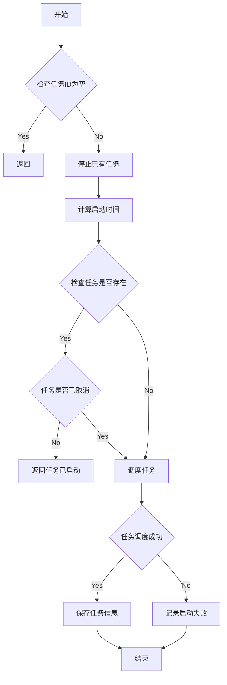
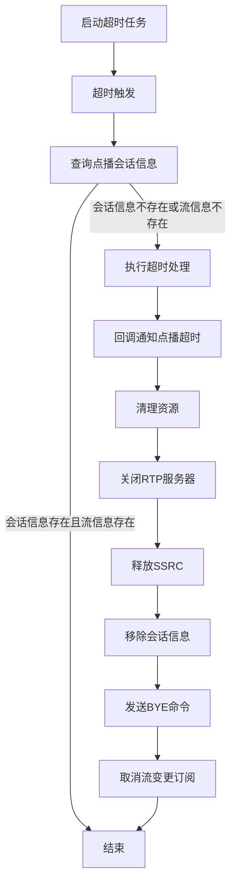
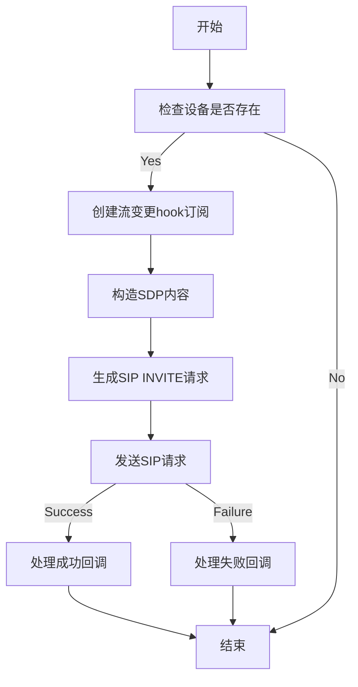
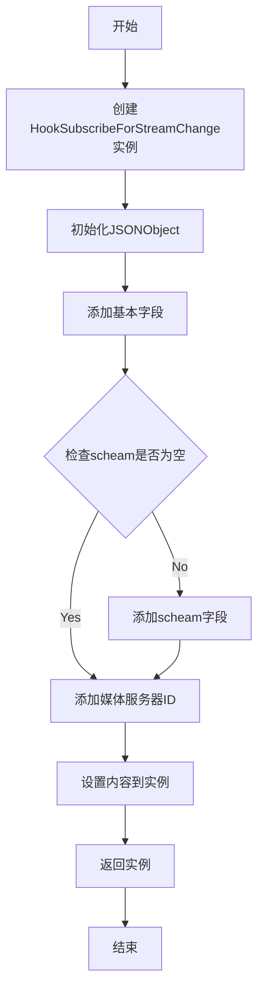
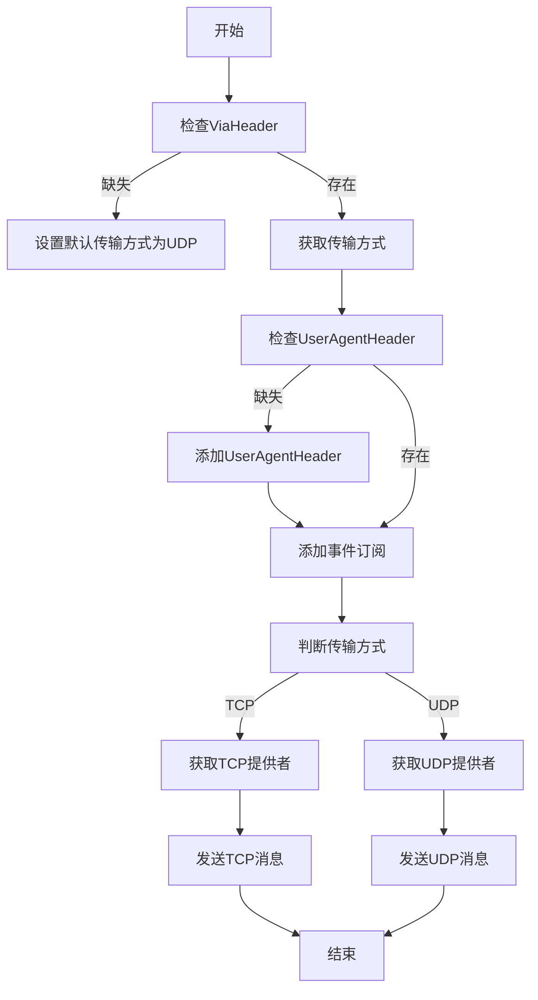

```mermaid
flowchart TD
    Start[开始] --> CheckKeyEmpty{检查任务ID为空}
    CheckKeyEmpty -->|Yes| Return[返回]
    CheckKeyEmpty -->|No| StopTask[停止已有任务]
    StopTask --> CalculateTime[计算启动时间]
    CalculateTime --> CheckFutureExist{检查任务是否存在}
    CheckFutureExist -->|Yes| CheckCancelled{任务是否已取消}
    CheckCancelled -->|No| ReturnAlreadyStarted[返回任务已启动]
    CheckCancelled -->|Yes| ScheduleTask[调度任务]
    CheckFutureExist -->|No| ScheduleTask
    ScheduleTask --> TaskScheduled{任务调度成功}
    TaskScheduled -->|Yes| SaveTaskInfo[保存任务信息]
    TaskScheduled -->|No| LogFailure[记录启动失败]
    SaveTaskInfo --> End[结束]
    LogFailure --> End

```

```mermaid
flowchart TD
    Start[启动超时任务] --> Timeout[超时触发]
    Timeout --> Check[查询点播会话信息]
    Check -->|会话信息存在且流信息存在| End[结束]
    Check -->|会话信息不存在或流信息不存在| Handle[执行超时处理]
    Handle --> Notify[回调通知点播超时]
    Notify --> Cleanup[清理资源]
    Cleanup --> CloseRTP[关闭RTP服务器]
    CloseRTP --> ReleaseSSRC[释放SSRC]
    ReleaseSSRC --> RemoveSession[移除会话信息]
    RemoveSession --> SendBye[发送BYE命令]
    SendBye --> Unsubscribe[取消流变更订阅]
    Unsubscribe --> End

```

```mermaid
flowchart TD
    Start[开始] --> CheckDevice[检查设备是否存在]
    CheckDevice -->|Yes| CreateHook[创建流变更hook订阅]
    CreateHook --> BuildSDP[构造SDP内容]
    BuildSDP --> GenerateSIP[生成SIP INVITE请求]
    GenerateSIP --> SendRequest[发送SIP请求]
    SendRequest -->|Success| HandleSuccess[处理成功回调]
    SendRequest -->|Failure| HandleFailure[处理失败回调]
    HandleSuccess --> End[结束]
    HandleFailure --> End
    CheckDevice -->|No| End

```

```mermaid
flowchart TD
    Start[开始] --> CreateInstance[创建HookSubscribeForStreamChange实例]
    CreateInstance --> InitJSONObject[初始化JSONObject]
    InitJSONObject --> AddBasicFields[添加基本字段]
    AddBasicFields --> CheckScheamNull{检查scheam是否为空}
    CheckScheamNull -->|Yes| AddMediaServerId[添加媒体服务器ID]
    CheckScheamNull -->|No| AddScheamField[添加scheam字段]
    AddScheamField --> AddMediaServerId
    AddMediaServerId --> SetContent[设置内容到实例]
    SetContent --> ReturnInstance[返回实例]
    ReturnInstance --> End[结束]

```

```mermaid
flowchart TD
    Start[开始] --> CheckViaHeader[检查ViaHeader]
    CheckViaHeader -->|缺失| SetDefaultTransport[设置默认传输方式为UDP]
    CheckViaHeader -->|存在| GetTransport[获取传输方式]
    GetTransport --> CheckUserAgentHeader[检查UserAgentHeader]
    CheckUserAgentHeader -->|缺失| AddUserAgentHeader[添加UserAgentHeader]
    AddUserAgentHeader --> AddSubscriptions[添加事件订阅]
    CheckUserAgentHeader -->|存在| AddSubscriptions
    AddSubscriptions --> CheckTransport[判断传输方式]
    CheckTransport -->|TCP| GetTcpProvider[获取TCP提供者]
    CheckTransport -->|UDP| GetUdpProvider[获取UDP提供者]
    GetTcpProvider --> SendTcpMessage[发送TCP消息]
    GetUdpProvider --> SendUdpMessage[发送UDP消息]
    SendTcpMessage --> End[结束]
    SendUdpMessage --> End

```

