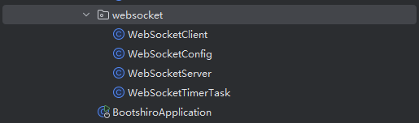

# Websocket学习文档

## 一、目录结构



```url
src/main/java/com/gbcom/wvp/websocket
```

WebSocketClient.java是server向别人发送ws请求，比如向安卓device发送的处理逻辑

WebSocketServer.java是server作为接受端，处理ws请求，比如请求安卓device发送过来的ws的处理逻辑

## 二、WebSocketServer.java

