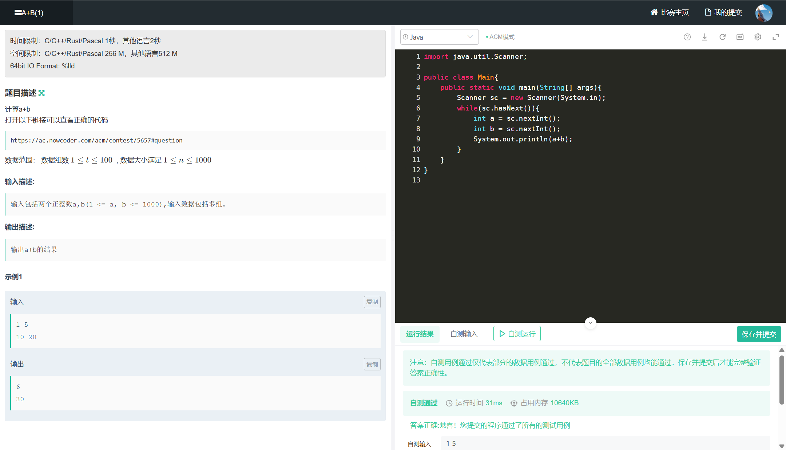
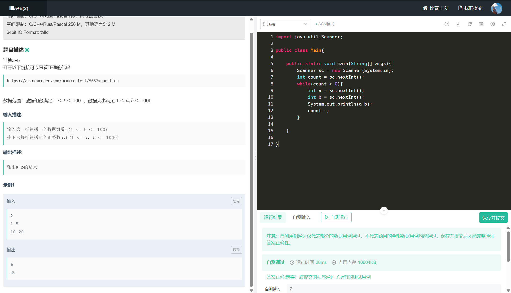
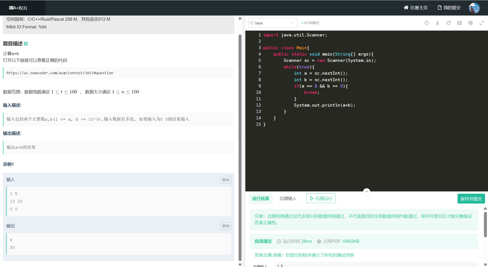
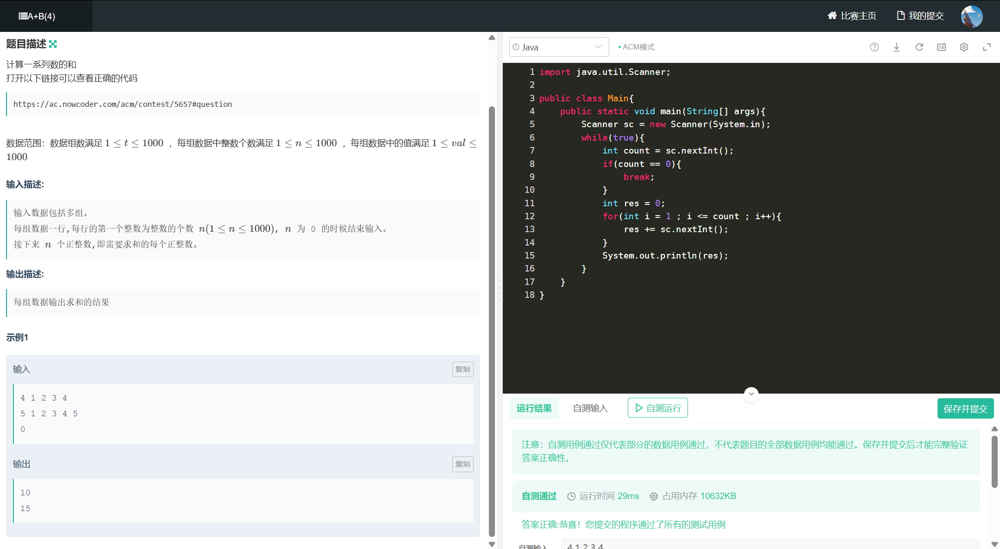
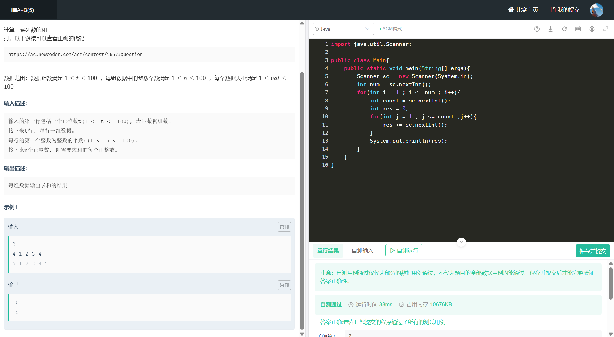
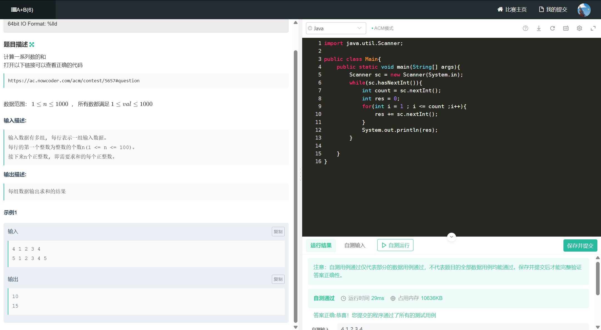

# ACM模式

**输入输出练习场：**

[牛客竞赛: OJ在线编程常见输入输出练习场](https://ac.nowcoder.com/acm/contest/5652?from=hr_test#question)

## 零、常识

- **`LinkedList`、`HashSet`、`TreeMap` 等** ：均属于 `java.util` 包，需显式导入。

- **`String`、`Math`、`System` 等** ：属于 `java.lang` 包，无需导入

- 可以通过 **`import java.util.*;`** 一次性导入 `java.util` 包中的所有类

  ```java
  import java.util.LinkedList
  import java.util.HashMap
  import java.util.ArrayList
  //一次性导入
  import java.util.*;
  ```
  
- `Integer.parseInt()`和`Integer.valueOf()`的主要区别？

  **`Integer.parseInt(String s)`**会返回一个`Int`类型,但是**`Integer.valueOf(String s)`**会返回一个`Integer`类型

​	Java中有基本类型和包装类型的自动转换，成为自动装箱和拆箱，以下是对照的表格

| 基本类型  | 包装类      | 自动装箱示例           | 自动拆箱示例                        |
| --------- | ----------- | ---------------------- | ----------------------------------- |
| `byte`    | `Byte`      | `Byte b = 100;`        | `byte b = new Byte((byte)100);`     |
| `short`   | `Short`     | `Short s = 200;`       | `short s = new Short((short)200);`  |
| `int`     | `Integer`   | `Integer i = 300;`     | `int i = new Integer(300);`         |
| `long`    | `Long`      | `Long l = 400L;`       | `long l = new Long(400L);`          |
| `float`   | `Float`     | `Float f = 3.14f;`     | `float f = new Float(3.14f);`       |
| `double`  | `Double`    | `Double d = 2.718;`    | `double d = new Double(2.718);`     |
| `char`    | `Character` | `Character c = 'A';`   | `char c = new Character('A');`      |
| `boolean` | `Boolean`   | `Boolean bool = true;` | `boolean bool = new Boolean(true);` |

-  **`String`** 不是基本数据类型,是一个引用类型，只不过做了优化，放在常量池中。对象一旦创建，内容不可修改。任何操作（如拼接）都会生成新对象：

## 〇、字符串


## 一、A+B（1）



```java
import java.util.Scanner;

public class Main{
    public static void main(String[] args){
        Scanner sc = new Scanner(System.in);
        while(sc.hasNext()){
            int a = sc.nextInt();
            int b = sc.nextInt();
            System.out.println(a+b);
        }
    }
}
```

## 二、A+B（2）



```java
import java.util.Scanner;

public class Main{
    
    public static void main(String[] args){
        Scanner sc = new Scanner(System.in);
        int count = sc.nextInt();
        while(count > 0){
            int a = sc.nextInt();
            int b = sc.nextInt();
            System.out.println(a+b);
            count--;
        }
        
    }
    
}
```

## 三、A+B（3）



```java
import java.util.Scanner;

public class Main{
    public static void main(String[] args){
        Scanner sc = new Scanner(System.in);
        while(true){
            int a = sc.nextInt();
            int b = sc.nextInt();
            if(a == 0 && b == 0){
                break;
            }
            System.out.println(a+b);
        }
    }
}
```

## 四、A+B（4）



```java
import java.util.Scanner;

public class Main{
    public static void main(String[] args){
        Scanner sc = new Scanner(System.in);
        while(true){
            int count = sc.nextInt();
            if(count == 0){
                break;
            }
            int res = 0;
            for(int i = 1 ; i <= count ; i++){
                res += sc.nextInt();
            }
            System.out.println(res);
        }
    }
}
```

## 五、A+B（5）



```java
import java.util.Scanner;

public class Main{
    public static void main(String[] args){
        Scanner sc = new Scanner(System.in);
        int num = sc.nextInt();
        for(int i = 1 ; i <= num ; i++){
            int count = sc.nextInt();
            int res = 0;
            for(int j = 1 ; j <= count ;j++){
                res += sc.nextInt();
            }
            System.out.println(res);
        }
    }
}
```

## 六、A+B（6）



```java
import java.util.Scanner;

public class Main{
    public static void main(String[] args){
        Scanner sc = new Scanner(System.in);
        while(sc.hasNextInt()){
            int count = sc.nextInt();
            int res = 0;
            for(int i = 1 ; i <= count ;i++){
                res += sc.nextInt();
            }
            System.out.println(res);
        }
        
    }
}
```

## 七、A+B（7）


