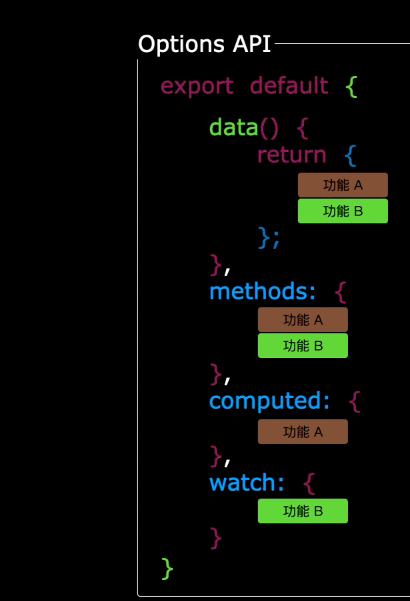

#  一、vue3项目结构

## 1.整体结构

```
my-vue3-project/
├── node_modules			 # 依赖的文件，类似于java中的jar包  
├── public/            # 静态资源目录（不经过构建处理）
│   └── favicon.ico    # 网站图标
├── src/							 # 源代码文件
│   ├── assets/        # 静态资源（图片、字体等，会经过构建处理）
│   │   └── logo.png
│   ├── components/    # 公共组件（可复用的 UI 组件）
│   │   └── Example.vue
│   ├── App.vue        # 根组件
│   └── main.js        # 入口文件（初始化 Vue 应用）
│
├── index.html       	 # 入口文件（使用vite），如果是webpack可能就是main.js或者main.js 
├── env.d.ts       		 # 这个文件的作用就是让项目识别jpg txt各种常用文件
├── package.json       # 项目依赖和脚本配置
├── package-lock.json  # 项目依赖和脚本配置(这个一般是自动生成的)
├── tsconfig.app.json  # 配置文件
├── tsconfig.json  		 # 配置文件
├── tsconfig.lock.json # 配置文件
└── vite.config.js     # 整个文件的配置，包括插件和代理都在这配置│
```

## 2.`index.html`

注意其中的`src="/src/main.ts"`支撑着一切

```html
<!DOCTYPE html>
<html lang="en">
<head>
  <meta charset="UTF-8">
  <link rel="icon" href="/favicon.ico">
  <meta name="viewport" content="width=device-width, initial-scale=1.0">
  <title>Vite App</title>
</head>
<body>
  <div id="app"></div>
  <script type="module" src="/src/main.ts"></script>
</body>
</html>
```

## 3.`src/main.js`

```ts
import './assets/main.css'
//引入createApp用于创建应用
import { createApp } from 'vue'
import App from './App.vue'
//引入App根组件
createApp(App).mount('#app')
```

如果把写app比喻成种花

`createApp`就是花盆（创建应用 ）

`App`就是花的根（组件），所以 `src/app.vue`就是组件了 ，而树叶和枝叶（组件）就是`compontents`下的vue组件

 **src中main.js和app.vue必不可少**  

## 4.App.vue

一个vue文件中，最基本就三个标签：`<template>` `<script>` `<style>`

```vue
<template>
	//用来写结构的，html
</template>

<script>
  //用来写交互的，js或者ts
</script>

<style>
  //用来写样式的
</style>

```

案例：

```vue
<template>
  <div class="app">
    <h1>你好啊！</h1>
  </div>
</template>

<script lang="ts">
export default {
  name: 'App' // 组件名，导出暴露给别人用的，App就是类似于唯一Id
}
</script>

<style>
.app {
  background-color: #ddd;
  box-shadow: 0 0 10px;
  border-radius: 10px;
  padding: 20px;
}
</style>
```

# 二、创建项目/一个例子

```vue
<template>
  <div class="person">
    <h2>姓名：{{name}}</h2>
    <h2>年龄：{{age}}</h2>
    <button @click="changeName">修改名字</button>
    <button @click="changeAge">年龄+1</button>
    <button @click="showTel">点我查看联系方式</button>
  </div>
</template>

<script lang="ts">
  export default {
    name:'App',
    data() {
      return {
        name:'张三',
        age:18,
        tel:'13888888888'
      }
    },
    methods:{
      changeName(){
        this.name = 'zhang-san'
      },
      changeAge(){
        this.age += 1
      },
      showTel(){
        alert(this.tel)
      }
    },
  }
</script>
```

### 1. **数据来源**

- ✅ **`<script>` 是数据和交互逻辑的核心**
  数据（如 `name`、`age`）和方法（如 `changeName`）都定义在 `<script>` 中，通过 `data()` 函数或 `methods` 对象暴露给模板（`<template>`）。
- 🚫 **`<template>` 只负责展示数据**
  它本身不存储数据，而是通过 `{{ }}` 或指令（如 `v-bind`）从 `<script>` 中获取数据并渲染。

### 2. **数据流动方向**

数据从 `<script>` 流向 `<template>`，形成单向绑定：

```vue
<script>
  data() { return { name: "张三" } }  // 数据源
</script>

<template>
  <h2>{{ name }}</h2>  <!-- 数据展示 -->
</template>
```

### 3. **进阶补充**

虽然数据主要来自 `<script>`，但实际开发中数据可能来自：

- **父组件传递** ：通过 `props` 接收数据。
- **全局状态管理** ：如 Vuex/Pinia（复杂应用中）。
- **异步请求** ：通过 API 调用获取数据（如 `axios`）。

但在你的示例中，数据确实完全由 `<script>` 的 `data()` 定义。

------

### 总结

在基础组件中，数据确实从 `<script>` 的 `data()` 出发，驱动 `<template>` 的动态渲染，而 `<style>` 只负责样式。这种分离设计让代码更清晰易维护。

# 三、vue3核心语法


## 3.1.  【OptionsAPI 与 CompositionAPI】

- `Vue2`的`API`设计是`Options`（配置）风格的。
- `Vue3`的`API`设计是`Composition`（组合）风格的。

###  Options API 的弊端

`Options`类型的 `API`，数据、方法、计算属性等，是分散在：`data`、`methods`、`computed`中的，若想新增或者修改一个需求，就需要分别修改：`data`、`methods`、`computed`，不便于维护和复用。




### Composition API 的优势

可以用函数的方式，更加优雅的组织代码，让相关功能的代码更加有序的组织在一起，也就是一个函数，包括的数据和计算所有的东西，集中在一起了


## 3.2. 【拉开序幕的 setup】

### setup 概述

`setup`是`Vue3`中一个新的配置项，值是一个函数，它是 `Composition API` **“表演的舞台**_**”**_，组件中所用到的：数据、方法、计算属性、监视......等等，均配置在`setup`中。

特点如下：

- `setup`函数返回的对象中的内容，可直接在模板中使用。
- `setup`中访问`this`是`undefined`。
- `setup`函数会在`beforeCreate`之前调用，它是“领先”所有钩子执行的。

```vue
<template>
  <div class="person">
    <h2>姓名：{{name}}</h2>
    <h2>年龄：{{age}}</h2>
    <button @click="changeName">修改名字</button>
    <button @click="changeAge">年龄+1</button>
    <button @click="showTel">点我查看联系方式</button>
  </div>
</template>

<script lang="ts">
  export default {
    name:'Person',
    setup(){
      // 数据，原来写在data中（注意：此时的name、age、tel数据都不是响应式数据）
      let name = '张三'
      let age = 18
      let tel = '13888888888'

      // 方法，原来写在methods中
      function changeName(){
        name = 'zhang-san' //注意：此时这么修改name页面是不变化的
        console.log(name)
      }
      function changeAge(){
        age += 1 //注意：此时这么修改age页面是不变化的
        console.log(age)
      }
      function showTel(){
        alert(tel)
      }

      // 返回一个对象，对象中的内容，模板中可以直接使用
      return {name,age,tel,changeName,changeAge,showTel}
    }
  }
</script>
```

### setup 的返回值

- 若返回一个**对象**：则对象中的：属性、方法等，在模板中均可以直接使用**（重点关注）。**
- 若返回一个**函数**：则可以自定义渲染内容，代码如下：

```jsx
setup(){
  return ()=> '你好啊！'
}
```

### setup 与 Options API 的关系

- `Vue2` 的配置（`data`、`methos`......）中**可以访问到** `setup`中的属性、方法。
- 但在`setup`中**不能访问到**`Vue2`的配置（`data`、`methos`......）。
- 如果与`Vue2`冲突，则`setup`优先。

> 也就是说，data、methods、setup这些都是可以同时存在的，但建议只写setup

> setup可以从data和method读取数据和方法，但是反过来就不行

### setup 语法糖

> 为什么要语法糖？因为再传统的写法中setup要卸载export中，并且要及时更新return的内容，很麻烦

`setup`函数有一个语法糖，这个语法糖，可以让我们把`setup`独立出去，并且可以自动return，代码如下：

```vue
<template>
  <div class="person">
    <h2>姓名：{{name}}</h2>
    <h2>年龄：{{age}}</h2>
    <button @click="changName">修改名字</button>
    <button @click="changAge">年龄+1</button>
    <button @click="showTel">点我查看联系方式</button>
  </div>
</template>

<script lang="ts">
  export default {
    name:'Person',
  }
</script>

<!-- 下面的写法是setup语法糖 -->
<script setup lang="ts">
  console.log(this) //undefined
  
  // 数据（注意：此时的name、age、tel都不是响应式数据）
  let name = '张三'
  let age = 18
  let tel = '13888888888'

  // 方法
  function changName(){
    name = '李四'//注意：此时这么修改name页面是不变化的
  }
  function changAge(){
    console.log(age)
    age += 1 //注意：此时这么修改age页面是不变化的
  }
  function showTel(){
    alert(tel)
  }
</script>
```

扩展：上述代码，还需要编写一个不写`setup`的`script`标签，去指定组件名字，比较麻烦，我们可以借助`vite`中的插件简化

1. 第一步：`npm i vite-plugin-vue-setup-extend -D`
2. 第二步：`vite.config.ts`

```jsx
import { defineConfig } from 'vite'
import VueSetupExtend from 'vite-plugin-vue-setup-extend'

export default defineConfig({
  plugins: [ VueSetupExtend() ]
})
```

3. 第三步：`<script setup lang="ts" name="Person">`

## 3.3. 【ref 创建：基本类型的响应式数据】

- **作用：**定义响应式变量。
- **语法：**`let xxx = ref(初始值)`。
- **返回值：**一个`RefImpl`的实例对象，简称`ref对象`或`ref`，`ref`对象的`value`**属性是响应式的**。
- **注意点：**
  - **`JS`中操作数据需要：`xxx.value`**，但模板中不需要`.value`，直接使用即可。
  - 对于`let name = ref('张三')`来说，`name`不是响应式的，`name.value`是响应式的。

> 需要什么数据是响应式的，就在这个数据前面加上ref就可以了，注意，ref只是针对基本数据类型的，对象的话用reactive

```vue
<template>
  <div class="person">
    <h2>姓名：{{name}}</h2>
    <h2>年龄：{{age}}</h2>
    <button @click="changeName">修改名字</button>
    <button @click="changeAge">年龄+1</button>
    <button @click="showTel">点我查看联系方式</button>
  </div>
</template>

<script setup lang="ts" name="Person">
  import {ref} from 'vue'
  // name和age是一个RefImpl的实例对象，简称ref对象，它们的value属性是响应式的。
  let name = ref('张三')
  let age = ref(18)
  // tel就是一个普通的字符串，不是响应式的
  let tel = '13888888888'

  function changeName(){
    // JS中操作ref对象时候需要.value
    name.value = '李四'
    console.log(name.value)

    // 注意：name不是响应式的，name.value是响应式的，所以如下代码并不会引起页面的更新。
    // name = ref('zhang-san')
  }
  function changeAge(){
    // JS中操作ref对象时候需要.value
    age.value += 1 
    console.log(age.value)
  }
  function showTel(){
    alert(tel)
  }
</script>
```

## 3.4. 【reactive 创建：对象类型的响应式数据】

- **作用：**定义一个**响应式对象**（基本类型不要用它，要用`ref`，否则报错）
- **语法：**`let 响应式对象= reactive(源对象)`。
- **返回值：**一个`Proxy`的实例对象，简称：响应式对象。
- **注意点：**`reactive`定义的响应式数据是“深层次”的。

```vue
<template>
  <div class="person">
    <h2>汽车信息：一台{{ car.brand }}汽车，价值{{ car.price }}万</h2>
    <h2>游戏列表：</h2>
    <ul>
        //:key其实就是v-bind:key的缩写，这个和vue有关
      <li v-for="g in games" :key="g.id">{{ g.name }}</li>
    </ul>
    <h2>测试：{{obj.a.b.c.d}}</h2>
    <button @click="changeCarPrice">修改汽车价格</button>
    <button @click="changeFirstGame">修改第一游戏</button>
    <button @click="test">测试</button>
  </div>
</template>

<script lang="ts" setup name="Person">
import { reactive } from 'vue'

// 数据
let car = reactive({ brand: '奔驰', price: 100 })
let games = reactive([
  { id: 'ahsgdyfa01', name: '英雄联盟' },
  { id: 'ahsgdyfa02', name: '王者荣耀' },
  { id: 'ahsgdyfa03', name: '原神' }
])
let obj = reactive({
  a:{
    b:{
      c:{
        d:666
      }
    }
  }
})

function changeCarPrice() {
  car.price += 10
}
function changeFirstGame() {
  games[0].name = '流星蝴蝶剑'
}
function test(){
  obj.a.b.c.d = 999
}
</script>
```


# Q&A

## 1. 单向绑定和双向绑定

| 特性             | 单向绑定                | 双向绑定                   |
| ---------------- | ----------------------- | -------------------------- |
| **数据流向**     | Script → Template       | Script ↔ Template          |
| **典型场景**     | 数据展示（如文本/数字） | 表单输入（input/textarea） |
| **Vue实现方式**  | `{{ }}`或`:value`       | `v-model`                  |
| **数据更新方式** | 需手动调用方法修改数据  | 自动同步数据               |

## 2. 响应式和非响应式
| **特性**         | **非响应式数据**             | **响应式数据**                                    |
|------------------|------------------------------|-------------------------------------------------|
| **声明方式**     | 普通变量 `let name = '张三'` | 使用 `ref()`/`reactive()` 包裹                   |
| **修改方式**     | 直接赋值 `name = 'new'`      | 需通过 `.value`（`ref`）或直接赋值（`reactive`） |
| **视图更新**     | ❌ 不自动更新                 | ✅ 自动触发视图更新                              |
| **Vue追踪能力**  | 无法追踪数据变化             | 自动追踪读写操作（Proxy/Object.defineProperty）  |
| **适用场景**     | 临时变量/无需更新的数据      | 需要驱动视图更新的状态数据                       |
| **数据类型支持** | 任意类型                     | `ref`：基本类型<br/>`reactive`：引用类型         |
| **模板使用**     | 直接使用但无响应性           | 自动解包（无需写`.value`）                       |
| **示例代码**     | `let age = 18`<br/>`age = 20` | `const age = ref(18)`<br/>`age.value = 20`     |
### 附加说明

1. **Vue2 vs Vue3**  
   
   - Vue2：使用 `Object.defineProperty` 实现响应式（不支持数组/对象属性动态添加）
   - Vue3：使用 `Proxy` 实现更完善的响应式系统
   
2. **响应式API选择**  
   
   ```javascript
   // 基本类型
   const count = ref(0)
   
   // 引用类型
   const state = reactive({ 
     name: '张三',
     age: 18 
   })

## 3.const 和 let的区别

| **对比维度**           | **let**                          | **const**                                    |
| ---------------------- | -------------------------------- | -------------------------------------------- |
| **变量类型**           | 可变变量（Mutable）              | 不可变常量（Immutable）                      |
| **重新赋值**           | 允许修改值 (`let x = 1; x = 2;`) | 禁止重新赋值 (`const x = 1; x = 2; // 报错`) |
| **作用域**             | 块级作用域                       | 块级作用域                                   |
| **TypeScript类型推断** | 类型可变（通过重新赋值改变类型） | 类型不可变（声明时确定）                     |
| **内存地址**           | 可指向新内存地址                 | 必须指向初始内存地址（引用类型不可变）       |

---

### **Vue3响应式场景对比**
| **场景**               | **let**                        | **const**                        |
| ---------------------- | ------------------------------ | -------------------------------- |
| **非响应式数据**       | 可修改值，但视图不更新         | 无法修改值（报错）               |
| **ref响应式数据**      | ❌ 不推荐（可能覆盖响应式对象） | ✅ 必须使用（保护响应式对象引用） |
| **reactive响应式数据** | ❌ 不推荐（可能覆盖响应式对象） | ✅ 必须使用（保护响应式对象引用） |

---

### **最佳实践**
| **使用场景**               | **推荐写法**           | **说明**                               |
| -------------------------- | ---------------------- | -------------------------------------- |
| 响应式数据（ref/reactive） | `const count = ref(0)` | 防止意外覆盖响应式对象，保持视图同步   |
| 非响应式常量               | `const MAX = 100`      | 固定值不可变（如配置、枚举）           |
| 临时可变变量               | `let temp = 0`         | 需要手动修改的中间变量（如循环计数器） |

---

### **陷阱示例**
```typescript
// ❌ 错误用法（覆盖响应式对象）
let count = ref(0);
count = 10; // 视图断开连接，控制台报错

// ✅ 正确用法
const count = ref(0);
count.value = 10; // 视图自动更新
```


# TODO

## 1.js箭头函数的特点了解下

```jsx
setup(){
  return ()=> '你好啊！'
}
```


