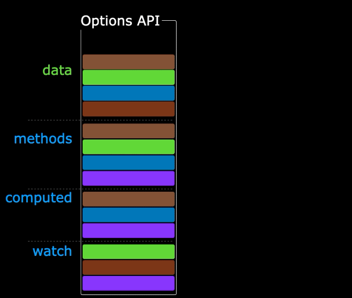

#  一、vue3项目结构

## 1.整体结构

```
my-vue3-project/
├── node_modules			 # 依赖的文件，类似于java中的jar包  
├── public/            # 静态资源目录（不经过构建处理）
│   └── favicon.ico    # 网站图标
├── src/							 # 源代码文件
│   ├── assets/        # 静态资源（图片、字体等，会经过构建处理）
│   │   └── logo.png
│   ├── components/    # 公共组件（可复用的 UI 组件）
│   │   └── Example.vue
│   ├── App.vue        # 根组件
│   └── main.js        # 入口文件（初始化 Vue 应用）
│
├── index.html       	 # 入口文件（使用vite），如果是webpack可能就是main.js或者main.js 
├── env.d.ts       		 # 这个文件的作用就是让项目识别jpg txt各种常用文件
├── package.json       # 项目依赖和脚本配置
├── package-lock.json  # 项目依赖和脚本配置(这个一般是自动生成的)
├── tsconfig.app.json  # 配置文件
├── tsconfig.json  		 # 配置文件
├── tsconfig.lock.json # 配置文件
└── vite.config.js     # 整个文件的配置，包括插件和代理都在这配置│
```

## 2.`index.html`

注意其中的`src="/src/main.ts"`支撑着一切

```html
<!DOCTYPE html>
<html lang="en">
<head>
  <meta charset="UTF-8">
  <link rel="icon" href="/favicon.ico">
  <meta name="viewport" content="width=device-width, initial-scale=1.0">
  <title>Vite App</title>
</head>
<body>
  <div id="app"></div>
  <script type="module" src="/src/main.ts"></script>
</body>
</html>
```

## 3.`src/main.js`

```ts
import './assets/main.css'
//引入createApp用于创建应用
import { createApp } from 'vue'
import App from './App.vue'
//引入App根组件
createApp(App).mount('#app')
```

如果把写app比喻成种花

`createApp`就是花盆（创建应用 ）

`App`就是花的根（组件），所以 `src/app.vue`就是组件了 ，而树叶和枝叶（组件）就是`compontents`下的vue组件

 **src中main.js和app.vue必不可少**  

## 4.App.vue

一个vue文件中，最基本就三个标签：`<template>` `<script>` `<style>`

```vue
<template>
	//用来写结构的，html
</template>

<script>
  //用来写交互的，js或者ts
</script>

<style>
  //用来写样式的
</style>

```

案例：

```vue
<template>
  <div class="app">
    <h1>你好啊！</h1>
  </div>
</template>

<script lang="ts">
export default {
  name: 'App' // 组件名，导出暴露给别人用的，App就是类似于唯一Id
}
</script>

<style>
.app {
  background-color: #ddd;
  box-shadow: 0 0 10px;
  border-radius: 10px;
  padding: 20px;
}
</style>
```

# 二、创建项目/一个例子

```vue
<template>
  <div class="person">
    <h2>姓名：{{name}}</h2>
    <h2>年龄：{{age}}</h2>
    <button @click="changeName">修改名字</button>
    <button @click="changeAge">年龄+1</button>
    <button @click="showTel">点我查看联系方式</button>
  </div>
</template>

<script lang="ts">
  export default {
    name:'App',
    data() {
      return {
        name:'张三',
        age:18,
        tel:'13888888888'
      }
    },
    methods:{
      changeName(){
        this.name = 'zhang-san'
      },
      changeAge(){
        this.age += 1
      },
      showTel(){
        alert(this.tel)
      }
    },
  }
</script>
```

### 1. **数据来源**

- ✅ **`<script>` 是数据和交互逻辑的核心**
  数据（如 `name`、`age`）和方法（如 `changeName`）都定义在 `<script>` 中，通过 `data()` 函数或 `methods` 对象暴露给模板（`<template>`）。
- 🚫 **`<template>` 只负责展示数据**
  它本身不存储数据，而是通过 `{{ }}` 或指令（如 `v-bind`）从 `<script>` 中获取数据并渲染。vue的原则之一就是要让这个template模板中尽量简单

### 2. **数据流动方向**

数据从 `<script>` 流向 `<template>`，形成单向绑定：

```vue
<script>
  data() { return { name: "张三" } }  // 数据源
</script>

<template>
  <h2>{{ name }}</h2>  <!-- 数据展示 -->
</template>
```

### 3. **进阶补充**

虽然数据主要来自 `<script>`，但实际开发中数据可能来自：

- **父组件传递** ：通过 `props` 接收数据。
- **全局状态管理** ：如 Vuex/Pinia（复杂应用中）。
- **异步请求** ：通过 API 调用获取数据（如 `axios`）。

但在你的示例中，数据确实完全由 `<script>` 的 `data()` 定义。

------

### 总结

在基础组件中，数据确实从 `<script>` 的 `data()` 出发，驱动 `<template>` 的动态渲染，而 `<style>` 只负责样式。这种分离设计让代码更清晰易维护。

# 三、vue3核心语法


## 3.1.  【OptionsAPI 与 CompositionAPI】

- `Vue2`的`API`设计是`Options`（配置）风格的。
- `Vue3`的`API`设计是`Composition`（组合）风格的。

###  Options API 的弊端

`Options`类型的 `API`，数据、方法、计算属性等，是分散在：`data`、`methods`、`computed`中的，若想新增或者修改一个需求，就需要分别修改：`data`、`methods`、`computed`，不便于维护和复用。


### Composition API 的优势

可以用函数的方式，更加优雅的组织代码，让相关功能的代码更加有序的组织在一起，也就是一个函数，包括的数据和计算所有的东西，集中在一起了




## 3.2. 【拉开序幕的 setup】

### setup 概述

`setup`是`Vue3`中一个新的配置项，值是一个函数，它是 `Composition API` **“表演的舞台**_**”**_，组件中所用到的：数据、方法、计算属性、监视......等等，均配置在`setup`中。

特点如下：

- `setup`函数返回的对象中的内容，可直接在模板中使用。
- `setup`中访问`this`是`undefined`。
- `setup`函数会在`beforeCreate`之前调用，它是“领先”所有钩子执行的。

```vue
<template>
  <div class="person">
    <h2>姓名：{{name}}</h2>
    <h2>年龄：{{age}}</h2>
    <button @click="changeName">修改名字</button>
    <button @click="changeAge">年龄+1</button>
    <button @click="showTel">点我查看联系方式</button>
  </div>
</template>

<script lang="ts">
  export default {
    name:'Person',
    setup(){
      // 数据，原来写在data中（注意：此时的name、age、tel数据都不是响应式数据）
      let name = '张三'
      let age = 18
      let tel = '13888888888'

      // 方法，原来写在methods中
      function changeName(){
        name = 'zhang-san' //注意：此时这么修改name页面是不变化的
        console.log(name)
      }
      function changeAge(){
        age += 1 //注意：此时这么修改age页面是不变化的
        console.log(age)
      }
      function showTel(){
        alert(tel)
      }

      // 返回一个对象，对象中的内容，模板中可以直接使用
      return {name,age,tel,changeName,changeAge,showTel}
    }
  }
</script>
```

### setup 的返回值

- 若返回一个**对象**：则对象中的：属性、方法等，在模板中均可以直接使用**（重点关注）。**
- 若返回一个**函数**：则可以自定义渲染内容，代码如下：

```jsx
setup(){
  return ()=> '你好啊！'
}
```

### setup 与 Options API 的关系

- `Vue2` 的配置（`data`、`methos`......）中**可以访问到** `setup`中的属性、方法。
- 但在`setup`中**不能访问到**`Vue2`的配置（`data`、`methos`......）。
- 如果与`Vue2`冲突，则`setup`优先。

> 也就是说，data、methods、setup这些都是可以同时存在的，但建议只写setup

> setup可以从data和method读取数据和方法，但是反过来就不行

### setup 语法糖

> 为什么要语法糖？因为再传统的写法中setup要卸载export中，并且要及时更新return的内容，很麻烦

`setup`函数有一个语法糖，这个语法糖，可以让我们把`setup`独立出去，并且可以自动return，代码如下：

```vue
<template>
  <div class="person">
    <h2>姓名：{{name}}</h2>
    <h2>年龄：{{age}}</h2>
    <button @click="changName">修改名字</button>
    <button @click="changAge">年龄+1</button>
    <button @click="showTel">点我查看联系方式</button>
  </div>
</template>

<script lang="ts">
  export default {
    name:'Person',
  }
</script>

<!-- 下面的写法是setup语法糖 -->
<script setup lang="ts">
  console.log(this) //undefined
  
  // 数据（注意：此时的name、age、tel都不是响应式数据）
  let name = '张三'
  let age = 18
  let tel = '13888888888'

  // 方法
  function changName(){
    name = '李四'//注意：此时这么修改name页面是不变化的
  }
  function changAge(){
    console.log(age)
    age += 1 //注意：此时这么修改age页面是不变化的
  }
  function showTel(){
    alert(tel)
  }
</script>
```

扩展：上述代码，还需要编写一个不写`setup`的`script`标签，去指定组件名字，比较麻烦，我们可以借助`vite`中的插件简化

1. 第一步：`npm i vite-plugin-vue-setup-extend -D`
2. 第二步：`vite.config.ts`

```jsx
import { defineConfig } from 'vite'
import VueSetupExtend from 'vite-plugin-vue-setup-extend'

export default defineConfig({
  plugins: [ VueSetupExtend() ]
})
```

3. 第三步：`<script setup lang="ts" name="Person">`

## 3.3. 【ref 创建：基本类型的响应式数据】

- **作用：**定义响应式变量。
- **语法：**`let xxx = ref(初始值)`。
- **返回值：**一个`RefImpl`的实例对象，简称`ref对象`或`ref`，`ref`对象的`value`**属性是响应式的**。
- **注意点：**
  - **`JS`中操作数据需要：`xxx.value`**，但模板中不需要`.value`，直接使用即可。
  - 对于`let name = ref('张三')`来说，`name`不是响应式的，`name.value`是响应式的。

> 需要什么数据是响应式的，就在这个数据前面加上ref就可以了，注意，ref只是针对基本数据类型的，对象的话用reactive

```vue
<template>
  <div class="person">
    <h2>姓名：{{name}}</h2>
    <h2>年龄：{{age}}</h2>
    <button @click="changeName">修改名字</button>
    <button @click="changeAge">年龄+1</button>
    <button @click="showTel">点我查看联系方式</button>
  </div>
</template>

<script setup lang="ts" name="Person">
  import {ref} from 'vue'
  // name和age是一个RefImpl的实例对象，简称ref对象，它们的value属性是响应式的。
  let name = ref('张三')
  let age = ref(18)
  // tel就是一个普通的字符串，不是响应式的
  let tel = '13888888888'

  function changeName(){
    // JS中操作ref对象时候需要.value
    name.value = '李四'
    console.log(name.value)

    // 注意：name不是响应式的，name.value是响应式的，所以如下代码并不会引起页面的更新。
    // name = ref('zhang-san')
  }
  function changeAge(){
    // JS中操作ref对象时候需要.value
    age.value += 1 
    console.log(age.value)
  }
  function showTel(){
    alert(tel)
  }
</script>
```

## 3.4. 【reactive 创建：对象类型的响应式数据】

- **作用：**定义一个**响应式对象**（基本类型不要用它，要用`ref`，否则报错）
- **语法：**`let 响应式对象= reactive(源对象)`。
- **返回值：**一个`Proxy`的实例对象，简称：响应式对象。
- **注意点：**`reactive`定义的响应式数据是“深层次”的。

```vue
<template>
  <div class="person">
    <h2>汽车信息：一台{{ car.brand }}汽车，价值{{ car.price }}万</h2>
    <h2>游戏列表：</h2>
    <ul>
        //:key其实就是v-bind:key的缩写，这个和vue有关
      <li v-for="g in games" :key="g.id">{{ g.name }}</li>
    </ul>
    <h2>测试：{{obj.a.b.c.d}}</h2>
    <button @click="changeCarPrice">修改汽车价格</button>
    <button @click="changeFirstGame">修改第一游戏</button>
    <button @click="test">测试</button>
  </div>
</template>

<script lang="ts" setup name="Person">
import { reactive } from 'vue'

// 数据
let car = reactive({ brand: '奔驰', price: 100 })
let games = reactive([
  { id: 'ahsgdyfa01', name: '英雄联盟' },
  { id: 'ahsgdyfa02', name: '王者荣耀' },
  { id: 'ahsgdyfa03', name: '原神' }
])
let obj = reactive({
  a:{
    b:{
      c:{
        d:666
      }
    }
  }
})

function changeCarPrice() {
  car.price += 10
}
function changeFirstGame() {
  games[0].name = '流星蝴蝶剑'
}
function test(){
  obj.a.b.c.d = 999
}
</script>
```

## 3.5. 【ref 创建：对象类型的响应式数据】

- 其实`ref`接收的数据可以是：**基本类型**、**对象类型**。
- 若`ref`接收的是对象类型，内部其实也是调用了`reactive`函数。

```vue
<template>
  <div class="person">
    <h2>汽车信息：一台{{ car.brand }}汽车，价值{{ car.price }}万</h2>
    <h2>游戏列表：</h2>
    <ul>
      <li v-for="g in games" :key="g.id">{{ g.name }}</li>
    </ul>
    <h2>测试：{{obj.a.b.c.d}}</h2>
    <button @click="changeCarPrice">修改汽车价格</button>
    <button @click="changeFirstGame">修改第一游戏</button>
    <button @click="test">测试</button>
  </div>
</template>

<script lang="ts" setup name="Person">
import { ref } from 'vue'

// 数据
let car = ref({ brand: '奔驰', price: 100 })
let games = ref([
  { id: 'ahsgdyfa01', name: '英雄联盟' },
  { id: 'ahsgdyfa02', name: '王者荣耀' },
  { id: 'ahsgdyfa03', name: '原神' }
])
let obj = ref({
  a:{
    b:{
      c:{
        d:666
      }
    }
  }
})

console.log(car)

function changeCarPrice() {
  car.value.price += 10
}
function changeFirstGame() {
  games.value[0].name = '流星蝴蝶剑'
}
function test(){
  obj.value.a.b.c.d = 999
}
</script>
```

> ref包裹对象修改的时候，要加上.value，而reactive包裹的对象修改的时候不需要加上.value

## 3.6. 【ref 对比 reactive】

宏观角度看：

> 1. `ref`用来定义：**基本类型数据**、**对象类型数据**；
>
> 2. `reactive`用来定义：**对象类型数据**。

- 区别：

> 1. `ref`创建的变量必须使用`.value`（可以使用`volar`插件自动添加`.value`）。
>
>    
>
> 2. `reactive`重新分配一个新对象，会**失去**响应式（可以使用`Object.assign`去整体替换）。ref但是可以

```js
function changeCar() {
  // car = {brand: '奥拓', price: 1} // 这么写页面不更新的，ref这么写可以
  // car = reactive({brand: '奥拓', price: 1}) // 这么写页面不更新的

  // 下面这个写法页面可以更新，这个就是reactive的弊端，不可以整体修改
  Object.assign(car, { brand: '奥拓', price: 1 });
}
```

- 使用原则：

> 1. 若需要一个基本类型的响应式数据，必须使用`ref`。
> 2. 若需要一个响应式对象，层级不深，`ref`、`reactive`都可以。
> 3. 若需要一个响应式对象，且层级较深，推荐使用`reactive`。

## 3.7. 【toRefs 与 toRef】

- 作用：将一个响应式对象中的每一个属性，转换为`ref`对象。
- 备注：`toRefs`与`toRef`功能一致，但`toRefs`可以批量转换。
- 语法如下：

```vue
<template>
  <div class="person">
    <h2>姓名：{{person.name}}</h2>
    <h2>年龄：{{person.age}}</h2>
    <h2>性别：{{person.gender}}</h2>
    <button @click="changeName">修改名字</button>
    <button @click="changeAge">修改年龄</button>
    <button @click="changeGender">修改性别</button>
  </div>
</template>

<script lang="ts" setup name="Person">
  import {ref,reactive,toRefs,toRef} from 'vue'

  // 数据
  let person = reactive({name:'张三', age:18, gender:'男'})
	
  // 通过toRefs将person对象中的n个属性批量取出，且依然保持响应式的能力
  let {name,gender} =  toRefs(person)
	
  // 通过toRef将person对象中的gender属性取出，且依然保持响应式的能力
  let age = toRef(person,'age')

  // 方法
  function changeName(){
    name.value += '~'
  }
  function changeAge(){
    age.value += 1
  }
  function changeGender(){
    gender.value = '女'
  }
</script>
```

## 3.8. 【computed】

作用：根据已有数据计算出新数据（和`Vue2`中的`computed`作用一致）。


```vue
<template>
  <div class="person">
    姓：<input type="text" v-model="firstName"> <br>
    名：<input type="text" v-model="lastName"> <br>
    全名：<span>{{fullName}}</span> <br>
    <button @click="changeFullName">全名改为：li-si</button>
  </div>
</template>

<script setup lang="ts" name="App">
  import {ref,computed} from 'vue'

  let firstName = ref('zhang')
  let lastName = ref('san')

  // 计算属性——只读取，不修改
  /* let fullName = computed(()=>{
    return firstName.value + '-' + lastName.value
  }) */


  // 计算属性——既读取又修改
  let fullName = computed({
    // 读取
    get(){
      return firstName.value + '-' + lastName.value
    },
    // 修改
    set(val){
      console.log('有人修改了fullName',val)
      firstName.value = val.split('-')[0]
      lastName.value = val.split('-')[1]
    }
  })

  function changeFullName(){
    fullName.value = 'li-si'
  } 
</script>
```

## 3.9.【watch】

> 这里有五种情况，第一种和第四种用的比较多

- 作用：监视数据的变化（和`Vue2`中的`watch`作用一致）
- 特点：`Vue3`中的`watch`只能监视以下**四种数据**：

> 1. `ref`定义的数据。
> 2. `reactive`定义的数据。
> 3. 函数返回一个值（`getter`函数）。
> 4. 一个包含上述内容的数组。

我们在`Vue3`中使用`watch`的时候，通常会遇到以下几种情况：

### * 情况一

监视`ref`定义的【基本类型】数据：直接写数据名即可，监视的是其`value`值的改变。

```vue
<template>
  <div class="person">
    <h1>情况一：监视【ref】定义的【基本类型】数据</h1>
    <h2>当前求和为：{{sum}}</h2>
    <button @click="changeSum">点我sum+1</button>
  </div>
</template>

<script lang="ts" setup name="Person">
  import {ref,watch} from 'vue'
  // 数据
  let sum = ref(0)
  // 方法
  function changeSum(){
    sum.value += 1
  }
  // 监视，情况一：监视【ref】定义的【基本类型】数据
  const stopWatch = watch(sum,(newValue,oldValue)=>{
    console.log('sum变化了',newValue,oldValue)
    if(newValue >= 10){
      stopWatch()
    }
  })
</script>
```

### * 情况二

监视`ref`定义的【对象类型】数据：直接写数据名，监视的是对象的【地址值】，若想监视对象内部的数据，要手动开启深度监视。

> 注意：
>
> * 若修改的是`ref`定义的对象中的属性，`newValue` 和 `oldValue` 都是新值，因为它们是同一个对象。
>
> * 若修改整个`ref`定义的对象，`newValue` 是新值， `oldValue` 是旧值，因为不是同一个对象了。

```vue
<template>
  <div class="person">
    <h1>情况二：监视【ref】定义的【对象类型】数据</h1>
    <h2>姓名：{{ person.name }}</h2>
    <h2>年龄：{{ person.age }}</h2>
    <button @click="changeName">修改名字</button>
    <button @click="changeAge">修改年龄</button>
    <button @click="changePerson">修改整个人</button>
  </div>
</template>

<script lang="ts" setup name="Person">
  import {ref,watch} from 'vue'
  // 数据
  let person = ref({
    name:'张三',
    age:18
  })
  // 方法
  function changeName(){
    person.value.name += '~'
  }
  function changeAge(){
    person.value.age += 1
  }
  function changePerson(){
    person.value = {name:'李四',age:90}
  }
  /* 
    监视，情况一：监视【ref】定义的【对象类型】数据，监视的是对象的地址值，若想监视对象内部属性的变化，需要手动开启深度监视
    watch的第一个参数是：被监视的数据
    watch的第二个参数是：监视的回调
    watch的第三个参数是：配置对象（deep、immediate等等.....） 
  */
  watch(person,(newValue,oldValue)=>{
    console.log('person变化了',newValue,oldValue)
  },{deep:true})
  
</script>
```

### *  情况三

监视`reactive`定义的【对象类型】数据，且**默认开启了深度监视，且无法关闭**。

```vue
<template>
  <div class="person">
    <h1>情况三：监视【reactive】定义的【对象类型】数据</h1>
    <h2>姓名：{{ person.name }}</h2>
    <h2>年龄：{{ person.age }}</h2>
    <button @click="changeName">修改名字</button>
    <button @click="changeAge">修改年龄</button>
    <button @click="changePerson">修改整个人</button>
    <hr>
    <h2>测试：{{obj.a.b.c}}</h2>
    <button @click="test">修改obj.a.b.c</button>
  </div>
</template>

<script lang="ts" setup name="Person">
  import {reactive,watch} from 'vue'
  // 数据
  let person = reactive({
    name:'张三',
    age:18
  })
  let obj = reactive({
    a:{
      b:{
        c:666
      }
    }
  })
  // 方法
  function changeName(){
    person.name += '~'
  }
  function changeAge(){
    person.age += 1
  }
  function changePerson(){
    Object.assign(person,{name:'李四',age:80})
  }
  function test(){
    obj.a.b.c = 888
  }

  // 监视，情况三：监视【reactive】定义的【对象类型】数据，且默认是开启深度监视的
  watch(person,(newValue,oldValue)=>{
    console.log('person变化了',newValue,oldValue)
  })
  watch(obj,(newValue,oldValue)=>{
    console.log('Obj变化了',newValue,oldValue)
  })
</script>
```

### * 情况四

监视`ref`或`reactive`定义的【对象类型】数据中的**某个属性**，注意点如下：

1. 若该属性值**不是**【对象类型】，需要写成函数形式。
2. 若该属性值是**依然**是【对象类型】，可直接编，也可写成函数，建议写成函数。

结论：监视的要是对象里的属性，那么最好写函数式，注意点：若是对象监视的是地址值，需要关注对象内部，需要手动开启深度监视。

```vue
<template>
  <div class="person">
    <h1>情况四：监视【ref】或【reactive】定义的【对象类型】数据中的某个属性</h1>
    <h2>姓名：{{ person.name }}</h2>
    <h2>年龄：{{ person.age }}</h2>
    <h2>汽车：{{ person.car.c1 }}、{{ person.car.c2 }}</h2>
    <button @click="changeName">修改名字</button>
    <button @click="changeAge">修改年龄</button>
    <button @click="changeC1">修改第一台车</button>
    <button @click="changeC2">修改第二台车</button>
    <button @click="changeCar">修改整个车</button>
  </div>
</template>

<script lang="ts" setup name="Person">
  import {reactive,watch} from 'vue'

  // 数据
  let person = reactive({
    name:'张三',
    age:18,
    car:{
      c1:'奔驰',
      c2:'宝马'
    }
  })
  // 方法
  function changeName(){
    person.name += '~'
  }
  function changeAge(){
    person.age += 1
  }
  function changeC1(){
    person.car.c1 = '奥迪'
  }
  function changeC2(){
    person.car.c2 = '大众'
  }
  function changeCar(){
    person.car = {c1:'雅迪',c2:'爱玛'}
  }

  // 监视，情况四：监视响应式对象中的某个属性，且该属性是基本类型的，要写成函数式
  /* watch(()=> person.name,(newValue,oldValue)=>{
    console.log('person.name变化了',newValue,oldValue)
  }) */

  // 监视，情况四：监视响应式对象中的某个属性，且该属性是对象类型的，可以直接写，也能写函数，更推荐写函数
  watch(()=>person.car,(newValue,oldValue)=>{
    console.log('person.car变化了',newValue,oldValue)
  },{deep:true})
</script>
```

### * 情况五

监视上述的多个数据

```vue
<template>
  <div class="person">
    <h1>情况五：监视上述的多个数据</h1>
    <h2>姓名：{{ person.name }}</h2>
    <h2>年龄：{{ person.age }}</h2>
    <h2>汽车：{{ person.car.c1 }}、{{ person.car.c2 }}</h2>
    <button @click="changeName">修改名字</button>
    <button @click="changeAge">修改年龄</button>
    <button @click="changeC1">修改第一台车</button>
    <button @click="changeC2">修改第二台车</button>
    <button @click="changeCar">修改整个车</button>
  </div>
</template>

<script lang="ts" setup name="Person">
  import {reactive,watch} from 'vue'

  // 数据
  let person = reactive({
    name:'张三',
    age:18,
    car:{
      c1:'奔驰',
      c2:'宝马'
    }
  })
  // 方法
  function changeName(){
    person.name += '~'
  }
  function changeAge(){
    person.age += 1
  }
  function changeC1(){
    person.car.c1 = '奥迪'
  }
  function changeC2(){
    person.car.c2 = '大众'
  }
  function changeCar(){
    person.car = {c1:'雅迪',c2:'爱玛'}
  }

  // 监视，情况五：监视上述的多个数据
  watch([()=>person.name,person.car],(newValue,oldValue)=>{
    console.log('person.car变化了',newValue,oldValue)
  },{deep:true})

</script>
```

## 3.10. 【watchEffect】

* 官网：立即运行一个函数，同时响应式地追踪其依赖，并在依赖更改时重新执行该函数。

* `watch`对比`watchEffect`

  > 1. 都能监听响应式数据的变化，不同的是监听数据变化的方式不同
  >
  > 2. `watch`：要明确指出监视的数据
  >
  > 3. `watchEffect`：不用明确指出监视的数据（函数中用到哪些属性，那就监视哪些属性）。

* 示例代码：

  ```vue
  <template>
    <div class="person">
      <h1>需求：水温达到50℃，或水位达到20cm，则联系服务器</h1>
      <h2 id="demo">水温：{{temp}}</h2>
      <h2>水位：{{height}}</h2>
      <button @click="changePrice">水温+1</button>
      <button @click="changeSum">水位+10</button>
    </div>
  </template>
  
  <script lang="ts" setup name="Person">
    import {ref,watch,watchEffect} from 'vue'
    // 数据
    let temp = ref(0)
    let height = ref(0)
  
    // 方法
    function changePrice(){
      temp.value += 10
    }
    function changeSum(){
      height.value += 1
    }
  
    // 用watch实现，需要明确的指出要监视：temp、height
    watch([temp,height],(value)=>{
      // 从value中获取最新的temp值、height值
      const [newTemp,newHeight] = value
      // 室温达到50℃，或水位达到20cm，立刻联系服务器
      if(newTemp >= 50 || newHeight >= 20){
        console.log('联系服务器')
      }
    })
  
    // 用watchEffect实现，不用
    const stopWtach = watchEffect(()=>{
      // 室温达到50℃，或水位达到20cm，立刻联系服务器
      if(temp.value >= 50 || height.value >= 20){
        console.log(document.getElementById('demo')?.innerText)
        console.log('联系服务器')
      }
      // 水温达到100，或水位达到50，取消监视
      if(temp.value === 100 || height.value === 50){
        console.log('清理了')
        stopWtach()
      }
    })
  </script>
  ```

## 3.11 【标签的 ref 属性】

  作用：用于注册模板引用。

  > * 用在普通`DOM`标签上，获取的是`DOM`节点。
  >
  > * 用在组件标签上，获取的是组件实例对象。

  用在普通`DOM`标签上：

  ```vue
  <template>
    <div class="person">
      <h1 ref="title1">尚硅谷</h1>
      <h2 ref="title2">前端</h2>
      <h3 ref="title3">Vue</h3>
      <input type="text" ref="inpt"> <br><br>
      <button @click="showLog">点我打印内容</button>
    </div>
  </template>
  
  <script lang="ts" setup name="Person">
    import {ref} from 'vue'
  	
    let title1 = ref()
    let title2 = ref()
    let title3 = ref()
  
    function showLog(){
      // 通过id获取元素
      const t1 = document.getElementById('title1')
      // 打印内容
      console.log((t1 as HTMLElement).innerText)
      console.log((<HTMLElement>t1).innerText)
      console.log(t1?.innerText)
      
  		/************************************/
  		
      // 通过ref获取元素
      console.log(title1.value)
      console.log(title2.value)
      console.log(title3.value)
    }
  </script>
  ```

  用在组件标签上：

  ```vue
  <!-- 父组件App.vue -->
  <template>
    <Person ref="ren"/>
    <button @click="test">测试</button>
  </template>
  
  <script lang="ts" setup name="App">
    import Person from './components/Person.vue'
    import {ref} from 'vue'
  
    let ren = ref()
  
    function test(){
      console.log(ren.value.name)
      console.log(ren.value.age)
    }
  </script>
  
  
  <!-- 子组件Person.vue中要使用defineExpose暴露内容 -->
  <script lang="ts" setup name="Person">
    import {ref,defineExpose} from 'vue'
  	// 数据
    let name = ref('张三')
    let age = ref(18)
    /****************************/
    /****************************/
    // 使用defineExpose将组件中的数据交给外部
    defineExpose({name,age})
  </script>
  ```

  **总结**

  就是给html分配唯一id不要用`class="title1"`这种，否则会冲突，最好用`ref="title"`，这样可以解决冲突的问题，不同的vue文件中可以有相同热`ref`，有点局部变量的意思

## 3.12. 【props】

>  这个本质是组件用来接收外部变量的

  > ```js
  > // 定义一个接口，限制每个Person对象的格式
  > export interface PersonInter {
  > id:string,
  > name:string,
  >  age:number
  > }
  > 
  > // 定义一个自定义类型Persons
  > export type Persons = Array<PersonInter>
  > ```
  >
  > `App.vue`中代码：
  >
  > ```vue
  > <template>
  > 	<Person :list="persons"/>
  > </template>
  > 
  > <script lang="ts" setup name="App">
  > import Person from './components/Person.vue'
  > import {reactive} from 'vue'
  >  import {type Persons} from './types'
  > 
  >  let persons = reactive<Persons>([
  >   {id:'e98219e12',name:'张三',age:18},
  >    {id:'e98219e13',name:'李四',age:19},
  >     {id:'e98219e14',name:'王五',age:20}
  >   ])
  > </script>
  > 
  > ```
  >
  > `Person.vue`中代码：
  >
  > ```Vue
  > <template>
  > <div class="person">
  > <ul>
  >   <li v-for="item in list" :key="item.id">
  >      {{item.name}}--{{item.age}}
  >    </li>
  >  </ul>
  > </div>
  > </template>
  > 
  > <script lang="ts" setup name="Person">
  > import {defineProps} from 'vue'
  > import {type PersonInter} from '@/types'
  > 
  > // 第一种写法：仅接收
  > // const props = defineProps(['list'])
  > 
  > // 第二种写法：接收+限制类型
  > // defineProps<{list:Persons}>()
  > 
  > // 第三种写法：接收+限制类型+指定默认值+限制必要性
  > let props = withDefaults(defineProps<{list?:Persons}>(),{
  >   list:()=>[{id:'asdasg01',name:'小猪佩奇',age:18}]
  > })
  > console.log(props)
  > </script>
  > ```

## 3.13. 【生命周期】

* 概念：`Vue`组件实例在创建时要经历一系列的初始化步骤，在此过程中`Vue`会在合适的时机，调用特定的函数，从而让开发者有机会在特定阶段运行自己的代码，这些特定的函数统称为：生命周期钩子

* 规律：

  > 生命周期整体分为四个阶段，分别是：**创建、挂载、更新、销毁**，每个阶段都有两个钩子，一前一后。

* `Vue2`的生命周期

  > 创建阶段：`beforeCreate`、`created`
  >
  > 挂载阶段：`beforeMount`、`mounted`
  >
  > 更新阶段：`beforeUpdate`、`updated`
  >
  > 销毁阶段：`beforeDestroy`、`destroyed`

* `Vue3`的生命周期

  > 创建阶段：`setup`
  >
  > 挂载阶段：`onBeforeMount`、`onMounted`
  >
  > 更新阶段：`onBeforeUpdate`、`onUpdated`
  >
  > 卸载阶段：`onBeforeUnmount`、`onUnmounted`

* 常用的钩子：`onMounted`(挂载完毕)、`onUpdated`(更新完毕)、`onBeforeUnmount`(卸载之前)

* 示例代码：

  ```vue
  <template>
    <div class="person">
      <h2>当前求和为：{{ sum }}</h2>
      <button @click="changeSum">点我sum+1</button>
    </div>
  </template>
  
  <!-- vue3写法 -->
  <script lang="ts" setup name="Person">
    import { 
      ref, 
      onBeforeMount, 
      onMounted, 
      onBeforeUpdate, 
      onUpdated, 
      onBeforeUnmount, 
      onUnmounted 
    } from 'vue'
  
    // 数据
    let sum = ref(0)
    // 方法
    function changeSum() {
      sum.value += 1
    }
    console.log('setup')
    // 生命周期钩子
    onBeforeMount(()=>{
      console.log('挂载之前')
    })
    onMounted(()=>{
      console.log('挂载完毕')
    })
    onBeforeUpdate(()=>{
      console.log('更新之前')
    })
    onUpdated(()=>{
      console.log('更新完毕')
    })
    onBeforeUnmount(()=>{
      console.log('卸载之前')
    })
    onUnmounted(()=>{
      console.log('卸载完毕')
    })
  </script>
  ```

## 3.14. 【自定义hook】

- 什么是`hook`？—— 本质是一个函数，把`setup`函数中使用的`Composition API`进行了封装，类似于`vue2.x`中的`mixin`。

- 自定义`hook`的优势：复用代码, 让`setup`中的逻辑更清楚易懂。

示例代码：

- `useSum.ts`中内容如下：

  ```js
  import {ref,onMounted} from 'vue'
  
  export default function(){
    let sum = ref(0)
  
    const increment = ()=>{
      sum.value += 1
    }
    const decrement = ()=>{
      sum.value -= 1
    }
    onMounted(()=>{
      increment()
    })
  
    //向外部暴露数据
    return {sum,increment,decrement}
  }		
  ```

- `useDog.ts`中内容如下：

  ```js
  import {reactive,onMounted} from 'vue'
  import axios,{AxiosError} from 'axios'
  
  export default function(){
    let dogList = reactive<string[]>([])
  
    // 方法
    async function getDog(){
      try {
        // 发请求
        let {data} = await axios.get('https://dog.ceo/api/breed/pembroke/images/random')
        // 维护数据
        dogList.push(data.message)
      } catch (error) {
        // 处理错误
        const err = <AxiosError>error
        console.log(err.message)
      }
    }
  
    // 挂载钩子
    onMounted(()=>{
      getDog()
    })
  	
    //向外部暴露数据
    return {dogList,getDog}
  }
  ```

- 组件中具体使用：

  ```vue
  <template>
    <h2>当前求和为：{{sum}}</h2>
    <button @click="increment">点我+1</button>
    <button @click="decrement">点我-1</button>
    <hr>
     
    <span v-show="dogList.isLoading">加载中......</span><br>
    <button @click="getDog">再来一只狗</button>
  </template>
  
  <script lang="ts">
    import {defineComponent} from 'vue'
  
    export default defineComponent({
      name:'App',
    })
  </script>
  
  <script setup lang="ts">
    import useSum from './hooks/useSum'
    import useDog from './hooks/useDog'
  	
    let {sum,increment,decrement} = useSum()
    let {dogList,getDog} = useDog()
  </script>
  ```

    


# Q&A

## 1. 单向绑定和双向绑定

| 特性             | 单向绑定                | 双向绑定                   |
| ---------------- | ----------------------- | -------------------------- |
| **数据流向**     | Script → Template       | Script ↔ Template          |
| **典型场景**     | 数据展示（如文本/数字） | 表单输入（input/textarea） |
| **Vue实现方式**  | `{{ }}`或`:value`       | `v-model`                  |
| **数据更新方式** | 需手动调用方法修改数据  | 自动同步数据               |

## 2. 响应式和非响应式
| **特性**         | **非响应式数据**             | **响应式数据**                                    |
|------------------|------------------------------|-------------------------------------------------|
| **声明方式**     | 普通变量 `let name = '张三'` | 使用 `ref()`/`reactive()` 包裹                   |
| **修改方式**     | 直接赋值 `name = 'new'`      | 需通过 `.value`（`ref`）或直接赋值（`reactive`） |
| **视图更新**     | ❌ 不自动更新                 | ✅ 自动触发视图更新                              |
| **Vue追踪能力**  | 无法追踪数据变化             | 自动追踪读写操作（Proxy/Object.defineProperty）  |
| **适用场景**     | 临时变量/无需更新的数据      | 需要驱动视图更新的状态数据                       |
| **数据类型支持** | 任意类型                     | `ref`：基本类型<br/>`reactive`：引用类型         |
| **模板使用**     | 直接使用但无响应性           | 自动解包（无需写`.value`）                       |
| **示例代码**     | `let age = 18`<br/>`age = 20` | `const age = ref(18)`<br/>`age.value = 20`     |
### 附加说明

1. **Vue2 vs Vue3**  
   
   - Vue2：使用 `Object.defineProperty` 实现响应式（不支持数组/对象属性动态添加）
   - Vue3：使用 `Proxy` 实现更完善的响应式系统
   
2. **响应式API选择**  
   
   ```javascript
   // 基本类型
   const count = ref(0)
   
   // 引用类型
   const state = reactive({ 
     name: '张三',
     age: 18 
   })

## 3.const 和 let的区别

| **对比维度**           | **let**                          | **const**                                    |
| ---------------------- | -------------------------------- | -------------------------------------------- |
| **变量类型**           | 可变变量（Mutable）              | 不可变常量（Immutable）                      |
| **重新赋值**           | 允许修改值 (`let x = 1; x = 2;`) | 禁止重新赋值 (`const x = 1; x = 2; // 报错`) |
| **作用域**             | 块级作用域                       | 块级作用域                                   |
| **TypeScript类型推断** | 类型可变（通过重新赋值改变类型） | 类型不可变（声明时确定）                     |
| **内存地址**           | 可指向新内存地址                 | 必须指向初始内存地址（引用类型不可变）       |

---

### **Vue3响应式场景对比**
| **场景**               | **let**                        | **const**                        |
| ---------------------- | ------------------------------ | -------------------------------- |
| **非响应式数据**       | 可修改值，但视图不更新         | 无法修改值（报错）               |
| **ref响应式数据**      | ❌ 不推荐（可能覆盖响应式对象） | ✅ 必须使用（保护响应式对象引用） |
| **reactive响应式数据** | ❌ 不推荐（可能覆盖响应式对象） | ✅ 必须使用（保护响应式对象引用） |

---

### **最佳实践**
| **使用场景**               | **推荐写法**           | **说明**                               |
| -------------------------- | ---------------------- | -------------------------------------- |
| 响应式数据（ref/reactive） | `const count = ref(0)` | 防止意外覆盖响应式对象，保持视图同步   |
| 非响应式常量               | `const MAX = 100`      | 固定值不可变（如配置、枚举）           |
| 临时可变变量               | `let temp = 0`         | 需要手动修改的中间变量（如循环计数器） |

---

### **陷阱示例**
```typescript
// ❌ 错误用法（覆盖响应式对象）
let count = ref(0);
count = 10; // 视图断开连接，控制台报错

// ✅ 正确用法
const count = ref(0);
count.value = 10; // 视图自动更新
```

## 4.wantch/watchEffect如何停止？

以下代码是一个watch代码，在 Vue3 中，无论是 `watch` 还是 `watchEffect`，它们都会返回一个 **停止函数（stop function）** ，调用这个函数即可主动停止监听，平常用不大停止函数，就不需要定义一个变量接受停止函数：`const stopWtach =`

```ts
// 用watchEffect实现，不用
  const stopWtach = watchEffect(()=>{
    // 室温达到50℃，或水位达到20cm，立刻联系服务器
    if(temp.value >= 50 || height.value >= 20){
      console.log(document.getElementById('demo')?.innerText)
      console.log('联系服务器')
    }
    // 水温达到100，或水位达到50，取消监视
    if(temp.value === 100 || height.value === 50){
      console.log('清理了')
      stopWtach()
    }
  })
```


# TODO

## 1.js箭头函数的特点了解下


